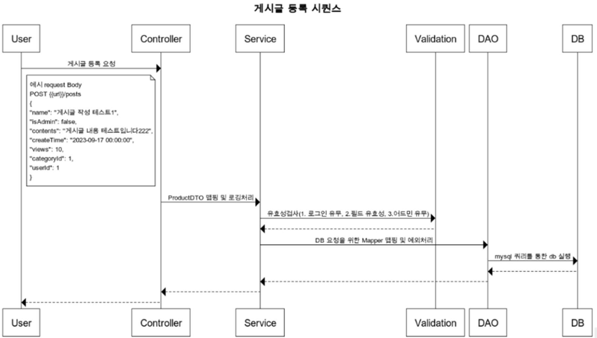

# Board

## 프로젝트 개요
개발을 처음 시작할 때 누구나 한 번쯤 만들어봤을 게시판, 이제는 성능과 트래픽을 고려해 진화시켜보자.

## 기술 스택
- **JDK**: OpenJDK 17
- **Framework**: Spring Boot 2.3
- **Database**: MySQL 8.0
- **Caching**: Redis
- **ORM**: MyBatis

## 아키텍처

## ERD 다이어그램

## 시퀀스 다이어그램

### 게시글 검색 시퀀스 다이어그램

### 게시글 작성 시퀀스 다이어그램

## 주요 기능

### 회원 관리
- **회원 가입 및 탈퇴**:
    - 새로운 회원의 가입과 기존 회원의 탈퇴 기능
- **아이디 및 닉네임 중복 체크**:
    - 사용자가 입력한 아이디 및 닉네임의 중복 여부를 검사
- **비밀번호 암호화**:
    - 회원의 비밀번호를 안전하게 암호화하여 저장
- **로그인 및 로그아웃**:
    - 회원의 로그인 및 로그아웃 처리

### 게시판 관리
- **카테고리 관리**:
    - 게시판 카테고리의 추가, 삭제, 수정 기능
- **게시글 관리**:
    - 게시글의 작성, 삭제, 수정 및 조회 기능
    - 파일 업로드 및 관리 기능 포함
- **게시글 검색 기능**:
    - 작성자 아이디, 게시글 제목, 게시글 내용 등을 통한 검색 기능
- **태그 기능**:
    - 게시글에 태그를 추가하고 태그를 통해 게시글을 조회하는 기능
- **댓글 작성 기능**:
    - 게시글에 대한 댓글 작성 및 관리 기능

